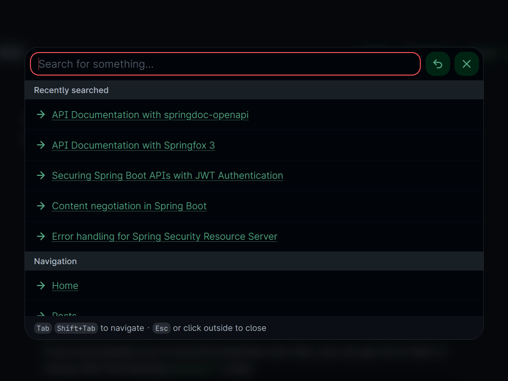
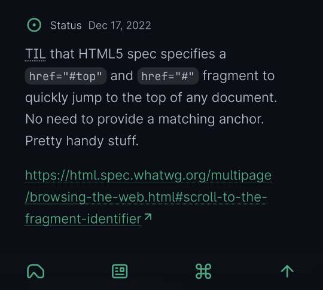
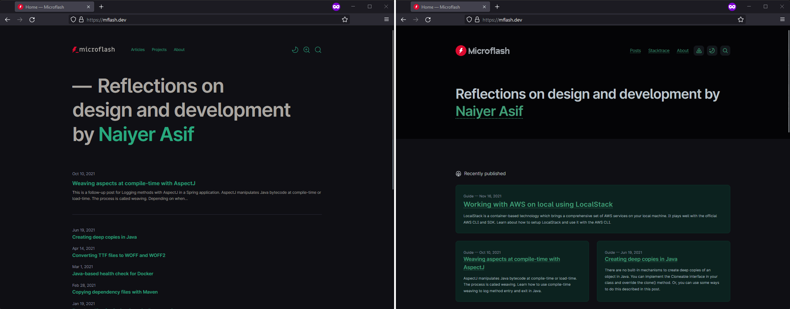
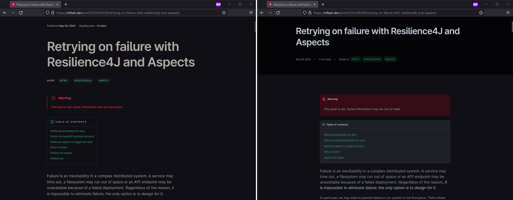
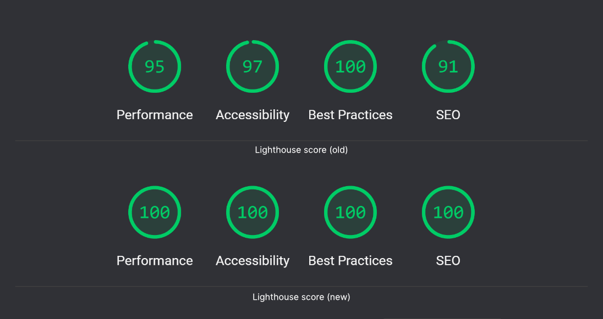
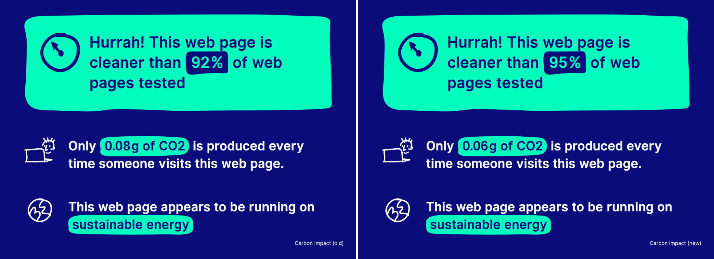

:::elx{.timeline}

- :time[2023-07-13 21:49:06]

	[v4](https://github.com/naiyerasif/site/tree/v4)

	This is an iterative update, prompted by the [sale](https://news.ycombinator.com/item?id=36346454) of [Google Domains](https://domains.google/) to Squarespace, which led to the domain migration to [Cloudflare](https://www.cloudflare.com/).

	**Added**

	- New canonical domain: [naiyerasif.com](/) replaces [naiyer.dev](https://naiyer.dev) and [mflash.dev](https://mflash.dev), which are now redirecting

	**Changed**

	- Homepage and posts listing now show 20 items per page, up from 10
	- Accessibility improvements raised Lighthouse score from 96 to 98

	**Fixed**

	- Command Bar now works with keyboard <kbd>Ctrl</kbd> <kbd>K</kbd> which was crashing on Safari and Firefox

- :time[2023-02-11 18:41:22]

	[v3](https://github.com/naiyerasif/site/tree/v3)

	**Added**

	- A new domain: [naiyer.dev](https://naiyer.dev). This replaces the old [mflash.dev](https://mflash.dev), aligning with a move away from my "Microflash" Twitter handle. Redirection rules are live to ensure a smooth transition.
	- A new Command bar inspired by macOS [Spotlight](https://en.wikipedia.org/wiki/Spotlight_(Apple)), replacing the old search feature. Powered by <data value="6.6.2">[Fuse.js](https://fusejs.io/)</data>, it allows fuzzy searching across posts, navigation, and preferences.

		:::figure{.frame}
		

		::caption[Command bar in action]
		:::
	- A bottom navigation bar for small screens, replacing the top-right hamburger menu

		:::figure{.frame}
		

		::caption[Bottom navigation bar (visible only on small screens)]
		:::
	- A new logo to uniquely represent my personal brand
	- An "everything" RSS feed that includes statuses in addition to the existing main feed

	**Changed**

	- Site architecture rewritten to support greater content ownership and consolidation. Much of the content scattered across platforms (like Twitter) is now centralized here.
	- RSS link moved to the footer with more context through [Matt Webb](https://interconnected.org/home/)'s [RSS explainer](https://aboutfeeds.com/)
	- Site now works with JavaScript turned off
	- Table of contents now displays more items to improve article navigation
	- Site generation moved from <data value="1.11.3">[Lume](https://lume.land/)</data> to <data value="2.0.6">[Astro](https://astro.build)</data>
	- Switched JavaScript runtime from <data value="1">[Deno](https://deno.land/)</data> to <data value="18">[Node.js](https://nodejs.org/en/)</data>

	**Removed**

	- <data value="3.10.3">[Alpine.js](https://alpinejs.dev/)</data> in favor of vanilla JavaScript and web components. JavaScript payload reduced from ~70KB to ~31KB.

- :time[2022-07-13 14:24:12]

	[v2](https://github.com/naiyerasif/site/tree/v2)

	**Added**

	- New layouts emphasizing content and semantic structure

		:::figure{.frame}
		

		

		::caption[Home Page and Post layouts (old on left, new on right)]
		:::

	- New design system with [perceptually uniform color palette](https://www.youtube.com/watch?v=dOsp6u4bIwI) and [calmer contrast](https://sarajoy.dev/blog/a11y-aspects/#anxiety-inducing-design)
	- Theme customization options including support for text size
	- All-green Lighthouse scores, skip links on every page, pronounced outlines for links and buttons, and ARIA attributes for better screen reader support

		:::figure
		

		::caption[Lighthouse score (source: [PageSpeed Insights](https://web.dev/measure/?url=https%3A%2F%2Fmflash.dev))]
		:::
	- Smaller carbon footprint

		:::figure
		

		::caption[Carbon impact estimates (source: [Website Carbon](https://www.websitecarbon.com/website/mflash-dev/))]
		:::

	**Changed**

	- Significantly reduced JavaScript shipped to the browser (from ~300KB to ~70KB) by switching from Vue SPA to a mostly static site with minimal interactive elements (search, theme switcher, and so on)
	- Switched static site generator from <data value="0.7.23">[Gridsome](https://github.com/gridsome/gridsome)</data> to <data value="1.10.0">[Lume](https://lume.land/)</data>
	- Switched JavaScript runtime from <data value="16">[Node.js](https://nodejs.org/en/)</data> to <data value="1">[Deno](https://deno.land/)</data>
	- Switched from <data value="2.6.12">[Vue](https://vuejs.org/)</data> to <data value="3.10.2">[Alpine.js](https://alpinejs.dev/)</data> for lightweight JavaScript needs
	- Replaced [CIELab](https://en.wikipedia.org/wiki/CIELAB_color_space) color space with [OkLab](https://bottosson.github.io/posts/oklab/), using [Leonardo](https://leonardocolor.io), for better color consistency and accessibility
	- Changed syntax highlighter from <data value="0.10.1">[Shiki](https://github.com/shikijs/shiki)</data> to <data value="1.0.1">[Starry Night](https://github.com/wooorm/starry-night)</data> (compatible with Deno, customizable through CSS)

	**Other things**

	- Added support for [Remark](https://github.com/remarkjs/remark) and [Rehype](https://github.com/rehypejs/rehype) in Lume through a [plugin](https://github.com/lumeland/experimental-plugins/commits/main/remark/remark.ts)
	- Created and published [remark-starry-night](https://github.com/Microflash/remark-starry-night) to integrate Starry Night for syntax highlighting, and [fenceparser](https://github.com/Microflash/fenceparser) to parse codeblock metadata

- :time[2019-06-30 13:37:56]

	[Inception!](https://github.com/naiyerasif/site/commit/2c7b6db3b7e013c5b6609c597cef10f84e53a1b7) Built with <data value="0.6.5">[Gridsome](https://github.com/gridsome/gridsome)</data> and <data value="2.6.10">[Vue](https://github.com/vuejs/vue)</data>

:::
