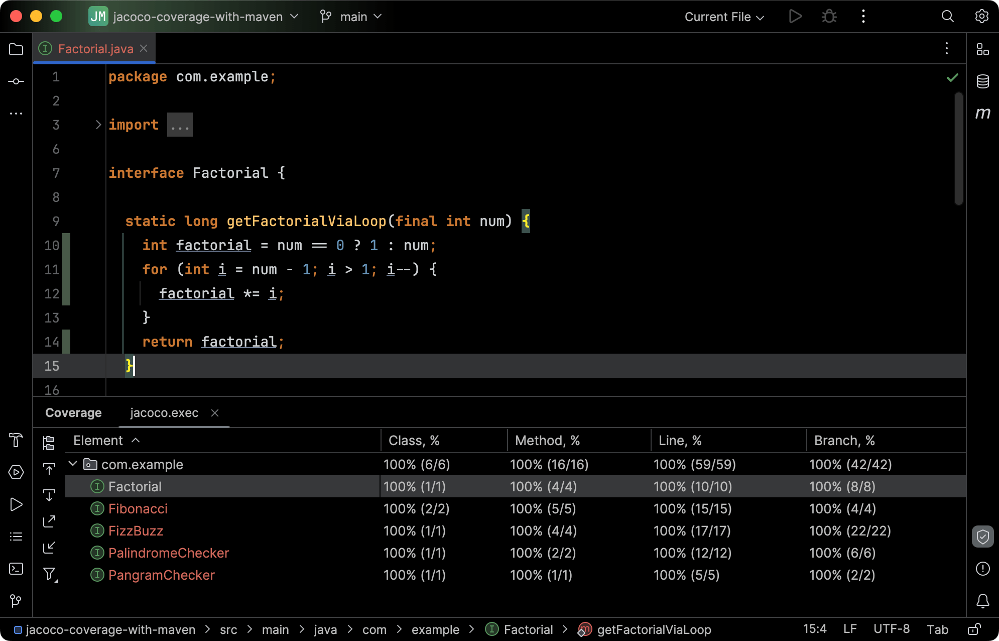
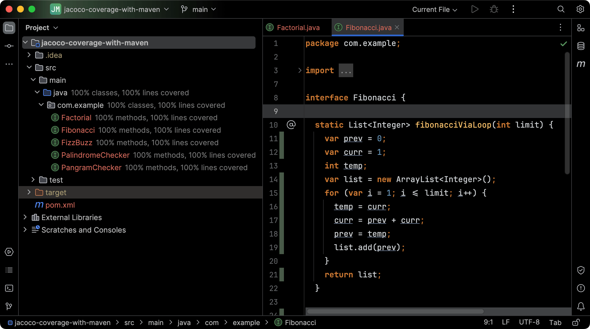
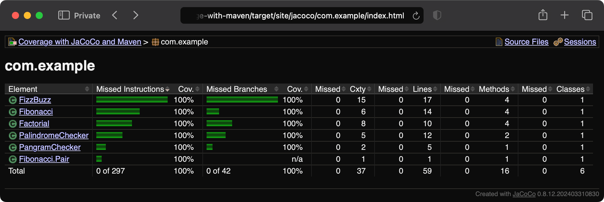

[JaCoCo](https://www.jacoco.org/jacoco/) is a popular Java library for measuring code coverage, that is, how much of your code runs during automated tests. It can generate coverage reports that you can use to assess the effectiveness of your tests.

In this post, we will integrate JaCoCo using Maven, and generate a coverage report that you can view in the browser.

:::note{.setup}
The examples in this post use

- Java 21
- JaCoCo 0.8.12
- Maven 3.9.8
:::

Create a Maven project with the following `pom.xml`.

```xml title="pom.xml"
<?xml version="1.0" encoding="UTF-8"?>
<project xmlns="http://maven.apache.org/POM/4.0.0"
				 xmlns:xsi="http://www.w3.org/2001/XMLSchema-instance"
				 xsi:schemaLocation="http://maven.apache.org/POM/4.0.0 http://maven.apache.org/xsd/maven-4.0.0.xsd">
	<modelVersion>4.0.0</modelVersion>

	<groupId>com.example</groupId>
	<artifactId>jacoco-coverage-with-maven</artifactId>
	<version>2.0.0</version>

	<properties>
		<encoding>UTF-8</encoding>
		<project.build.sourceEncoding>${encoding}</project.build.sourceEncoding>
		<project.reporting.outputEncoding>${encoding}</project.reporting.outputEncoding>
		<java.version>21</java.version>
		<maven.compiler.source>${java.version}</maven.compiler.source>
		<maven.compiler.target>${java.version}</maven.compiler.target>

		<junit.version>5.10.3</junit.version>
	</properties>

	<dependencies>
		<dependency>
			<groupId>org.assertj</groupId>
			<artifactId>assertj-core</artifactId>
			<version>3.26.0</version>
			<scope>test</scope>
		</dependency>
		<dependency>
			<groupId>org.junit.jupiter</groupId>
			<artifactId>junit-jupiter-api</artifactId>
			<version>${junit.version}</version>
			<scope>test</scope>
		</dependency>
		<dependency>
			<groupId>org.junit.jupiter</groupId>
			<artifactId>junit-jupiter-engine</artifactId>
			<version>${junit.version}</version>
			<scope>test</scope>
		</dependency>
		<dependency>
			<groupId>org.junit.jupiter</groupId>
			<artifactId>junit-jupiter-params</artifactId>
			<version>${junit.version}</version>
			<scope>test</scope>
		</dependency>
	</dependencies>

	<build>
		<plugins>
			<plugin>
				<groupId>org.apache.maven.plugins</groupId>
				<artifactId>maven-surefire-plugin</artifactId>
				<version>3.3.0</version>
			</plugin>
		</plugins>
	</build>
</project>
```

Copy the [sample code](https://github.com/Microflash/guides/tree/main/java/jacoco-coverage-with-maven/src/main/java/com/example) and [tests](https://github.com/Microflash/guides/tree/main/java/jacoco-coverage-with-maven/src/test) to follow along.

## Measuring coverage with JaCoCo Maven plugin

Add the JaCoCo plugin in the `pom.xml` with the following configuration.

```xml title="pom.xml" {56..77}
<?xml version="1.0" encoding="UTF-8"?>
<project xmlns="http://maven.apache.org/POM/4.0.0"
				 xmlns:xsi="http://www.w3.org/2001/XMLSchema-instance"
				 xsi:schemaLocation="http://maven.apache.org/POM/4.0.0 http://maven.apache.org/xsd/maven-4.0.0.xsd">
	<modelVersion>4.0.0</modelVersion>

	<groupId>com.example</groupId>
	<artifactId>jacoco-coverage-with-maven</artifactId>
	<version>2.0.0</version>

	<properties>
		<encoding>UTF-8</encoding>
		<project.build.sourceEncoding>${encoding}</project.build.sourceEncoding>
		<project.reporting.outputEncoding>${encoding}</project.reporting.outputEncoding>
		<java.version>21</java.version>
		<maven.compiler.source>${java.version}</maven.compiler.source>
		<maven.compiler.target>${java.version}</maven.compiler.target>

		<junit.version>5.10.3</junit.version>
	</properties>

	<dependencies>
		<dependency>
			<groupId>org.assertj</groupId>
			<artifactId>assertj-core</artifactId>
			<version>3.26.0</version>
			<scope>test</scope>
		</dependency>
		<dependency>
			<groupId>org.junit.jupiter</groupId>
			<artifactId>junit-jupiter-api</artifactId>
			<version>${junit.version}</version>
			<scope>test</scope>
		</dependency>
		<dependency>
			<groupId>org.junit.jupiter</groupId>
			<artifactId>junit-jupiter-engine</artifactId>
			<version>${junit.version}</version>
			<scope>test</scope>
		</dependency>
		<dependency>
			<groupId>org.junit.jupiter</groupId>
			<artifactId>junit-jupiter-params</artifactId>
			<version>${junit.version}</version>
			<scope>test</scope>
		</dependency>
	</dependencies>

	<build>
		<plugins>
			<plugin>
				<groupId>org.apache.maven.plugins</groupId>
				<artifactId>maven-surefire-plugin</artifactId>
				<version>3.3.0</version>
			</plugin>
			<plugin>
				<groupId>org.jacoco</groupId>
				<artifactId>jacoco-maven-plugin</artifactId>
				<version>0.8.12</version>
				<executions>
					<execution>
						<id>prepare-agent-for-unit-tests</id>
						<goals>
							<goal>prepare-agent</goal>
						</goals>
					</execution>
					<execution>
						<id>report-for-unit-tests</id>
						<goals>
							<goal>report</goal>
						</goals>
						<configuration>
							<title>Coverage with JaCoCo and Maven</title>
						</configuration>
					</execution>
				</executions>
			</plugin>
		</plugins>
	</build>
</project>
```

:::note
Maven uses the Surefire Plugin to run the unit tests of an application.
:::

JaCoCo measures the coverage by [instrumenting](https://www.jacoco.org/jacoco/trunk/doc/offline.html) the Java code through an [agent](https://mvnrepository.com/artifact/org.jacoco/org.jacoco.agent) which is where the `prepare-agent` goal comes into picture. During Maven's `verify` [lifecycle phase](https://maven.apache.org/guides/introduction/introduction-to-the-lifecycle.html), JaCoCo generates the report (using the `report` goal).

Run `mvn verify` command in a terminal to see this in action. After this commands finishes, you should get a `jacoco.exec` file in the `target` directory.

### Viewing the report in IntelliJ IDEA

Press <kbd>Shift</kbd> key twice and search "Import external coverage report" option in IntelliJ IDEA. Clicking the result should open file manager using which you can navigate and select the `target/jacoco.exec` file. Alternatively, open Coverage tool window by navigating to _View_ > _Tool Windows_ and selecting _Coverage_. Click _Import a report collected in CI from disk_ and select the `target/jacoco.exec` file. On successful import of the file, IntelliJ IDEA should display the coverage of each file as follows. You can open a file in the editor and it will show the lines covered by tests on the gutter.

:::figure{.popout.popout-image.frame}


::caption[Coverage imported from JaCoCo report showing line coverage of `Factorial` class]
:::

IntelliJ IDEA also displays the coverage in the Project panel against each file.

:::figure{.popout.popout-image.frame}


::caption[IntelliJ IDEA shows the coverage against each file in the Project panel]
:::

### Viewing the report in browser

With the current configuration in the `pom.xml` file, JaCoCo also generates the coverage report in HTML format which you can view in the browser. Open the `target/site/jacoco/index.html` file in the browser.

:::figure{.popout.popout-image.frame}


::caption[JaCoCo coverage report in the browser. The appearance of the report may vary depending on your browser preferences.]
:::

:::assert{title="Customizing the HTML report"}
You can customize the look and feel of the HTML report by editing the `target/site/jacoco/jacoco-resources/report.css` file. You can specify the title of the report using the `title` in the configuration (see `pom.xml` earlier).
:::

### Reports in XML and CSV formats

With the current configuration in the `pom.xml` file, JaCoCo also generates the coverage report in XML and CSV formats. Static analysis tools can read these reports and display the coverage on their dashboards. For example, SonarQube can read the `target/site/jacoco/jacoco.xml` file to integrate the coverage details for its quality gates.

## Enforcing coverage compliance

You may require a project to have certain coverage. If the tests fail to pass that threshold, the build should fail. To enforce such a policy, you can configure custom rules built around limits specified over a [coverage counter](https://www.jacoco.org/jacoco/trunk/doc/counters.html). JaCoCo uses these counters to calculate different coverage metrics.

Consider the following configuration.

```xml title="pom.xml JaCoCo plugin section" {21..40}
<plugin>
	<groupId>org.jacoco</groupId>
	<artifactId>jacoco-maven-plugin</artifactId>
	<version>0.8.12</version>
	<executions>
		<execution>
			<id>prepare-agent-for-unit-tests</id>
			<goals>
				<goal>prepare-agent</goal>
			</goals>
		</execution>
		<execution>
			<id>report-for-unit-tests</id>
			<goals>
				<goal>report</goal>
			</goals>
			<configuration>
				<title>Coverage with JaCoCo and Maven</title>
			</configuration>
		</execution>
		<execution>
			<id>check-for-unit-tests</id>
			<goals>
				<goal>check</goal>
			</goals>
			<configuration>
				<rules>
					<rule>
						<element>BUNDLE</element>
						<limits>
							<limit>
								<counter>INSTRUCTION</counter>
								<value>COVEREDRATIO</value>
								<minimum>0.75</minimum>
							</limit>
						</limits>
					</rule>
				</rules>
			</configuration>
		</execution>
	</executions>
</plugin>
```

Here, we have specified a coverage rule that enforces an instruction coverage of 75% using the `INSTRUCTION` counter. The instruction coverage counter provides information about the amount of code run or missed, irrespective of the formatting of the source code. These rules will apply over the entire application because we have specified them using a `BUNDLE` element.

If the instruction coverage falls below 75%, executing `mvn verify` will throw an error as follows, terminating the build.

```log {5}
...
[INFO] --- jacoco:0.8.12:check (check-for-unit-tests) @ jacoco-coverage-with-maven ---
[INFO] Loading execution data file ~/guides/java/jacoco-coverage-with-maven/target/jacoco.exec
[INFO] Analyzed bundle 'jacoco-coverage-with-maven' with 6 classes
[WARNING] Rule violated for bundle jacoco-coverage-with-maven: instructions covered ratio is 0.55, but expected minimum is 0.75
[INFO] ------------------------------------------------------------------------
[INFO] BUILD FAILURE
[INFO] ------------------------------------------------------------------------
[INFO] Total time:  1.410 s
[INFO] Finished at: 2024-07-01T00:11:08+05:30
[INFO] ------------------------------------------------------------------------
[ERROR] Failed to execute goal org.jacoco:jacoco-maven-plugin:0.8.12:check (check-for-unit-tests) on project jacoco-coverage-with-maven: Coverage checks have not been met. See log for details. -> [Help 1]
...
```

You can configure specific classes and other counters to customize the coverage rules. For more details, see the [official documentation](https://www.jacoco.org/jacoco/trunk/doc/index.html).

---

**Source code**

- [jacoco-coverage-with-maven](https://github.com/Microflash/guides/tree/main/java/jacoco-coverage-with-maven)

**Related**

- [JaCoCo Maven plugin docs](https://www.jacoco.org/jacoco/trunk/doc/maven.html)
- [JaCoCo report goal configuration](https://www.jacoco.org/jacoco/trunk/doc/report-mojo.html)
