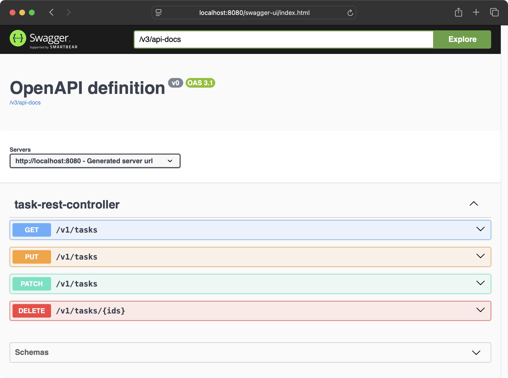
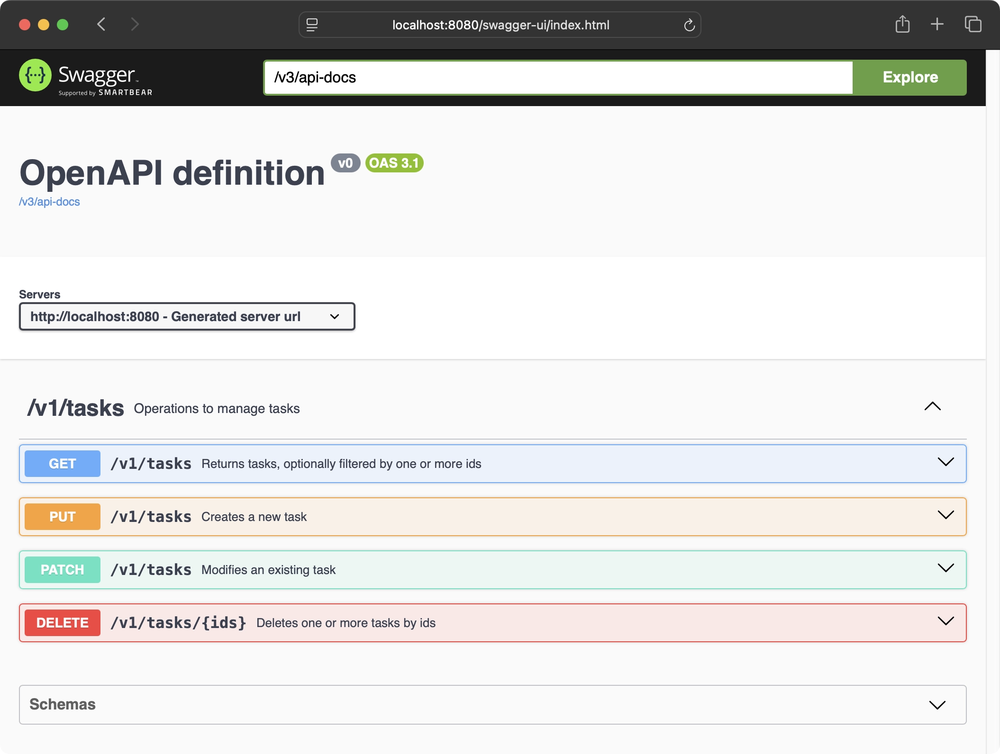
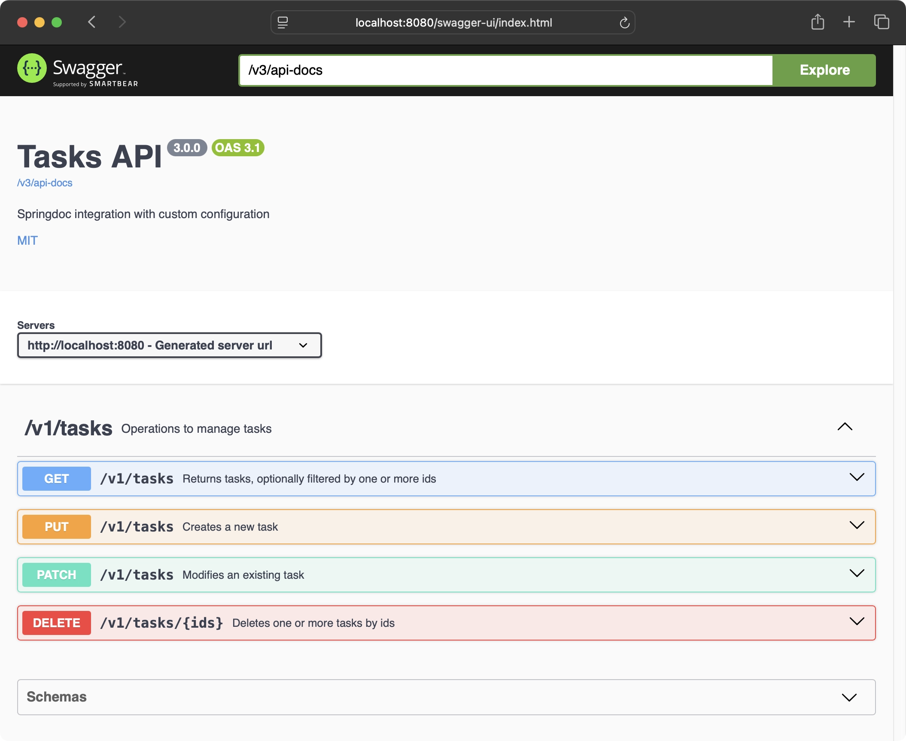
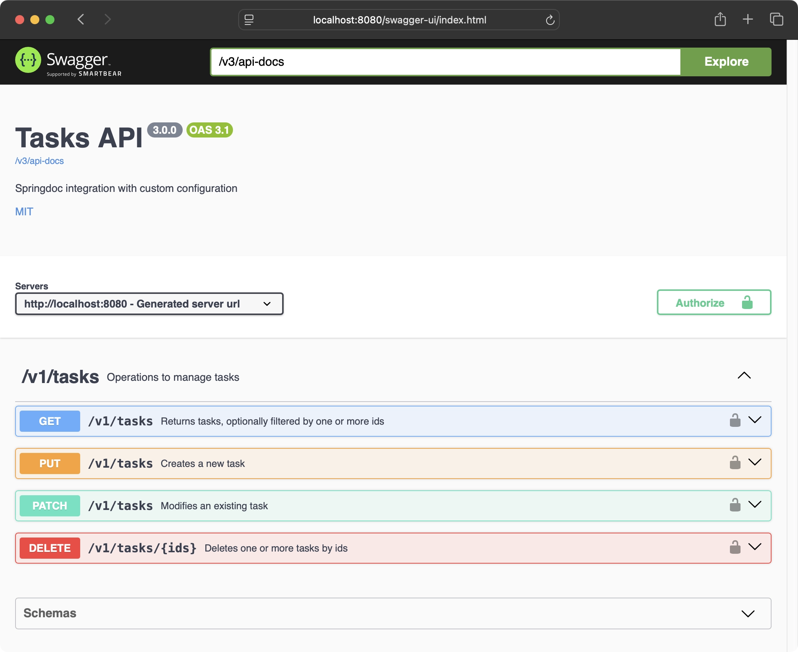
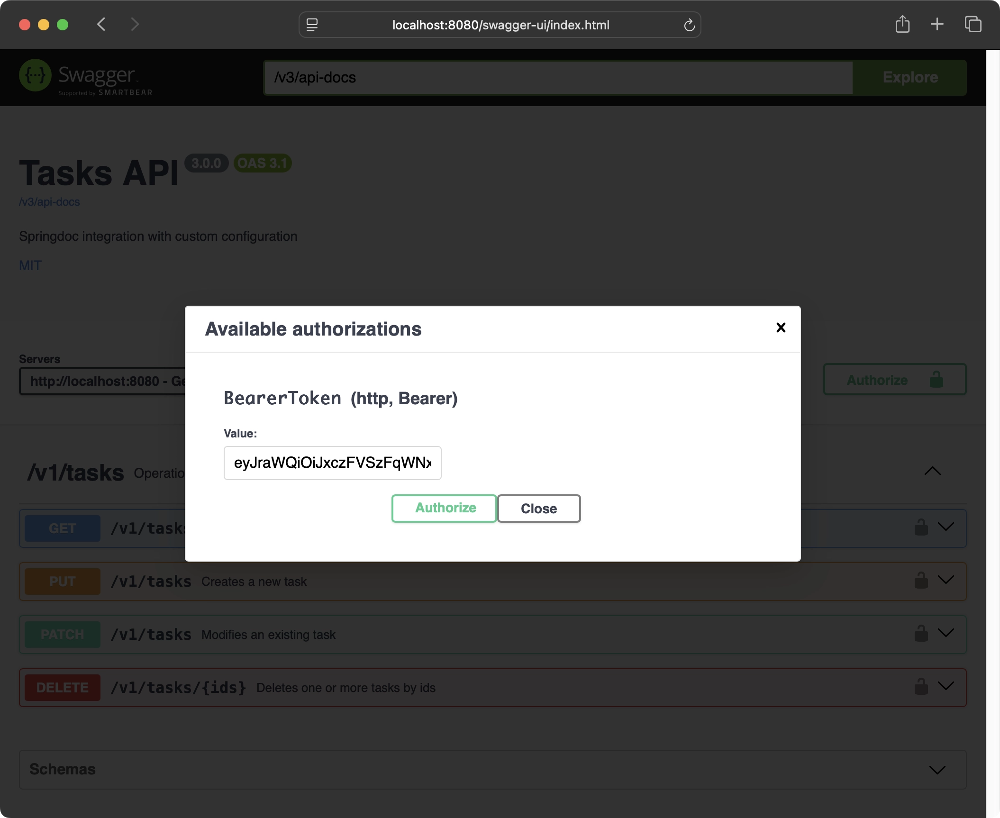
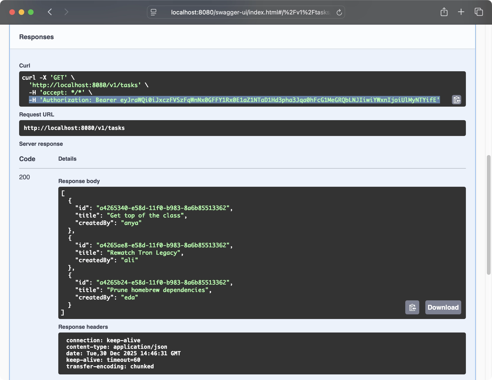

[OpenAPI Initiative](https://www.openapis.org/) is a widely adopted industry standard to describe and document API, with [Swagger](https://swagger.io/) being one of its most well-known implementations. [springdoc-openapi](https://springdoc.org/) is an actively maintained integration for Spring Boot applications to quickly generate and publish OpenAPI documentation. In this post, we'll explore how we can use Springdoc with a Spring Boot project.

:::note{.setup}
The examples in this post use:

- Spring Boot 4.0.1
- Java 25
- springdoc-openapi 3.0.0
- Testcontainers 2.0.3
- Docker 28.5.2
- Maven 3.9.12
:::

We'll start with a [sample Spring Boot application](https://github.com/Microflash/backstage/tree/cadc1328ec0d9ce57e1797fca92fe2ad077ee3ae/%40/templates/springboot4-tasks-api) that exposes a REST API through the `TaskRestController`. We'll gradually enhance this application for a better OpenAPI integration. First, let's add the `springdoc-openapi-starter-webmvc-ui` dependency in `pom.xml` to enable the OpenAPI integration.

```xml title="pom.xml" ins{36..40}
<?xml version="1.0" encoding="UTF-8"?>
<project xmlns="http://maven.apache.org/POM/4.0.0"
	xmlns:xsi="http://www.w3.org/2001/XMLSchema-instance" xsi:schemaLocation="http://maven.apache.org/POM/4.0.0 https://maven.apache.org/xsd/maven-4.0.0.xsd">
	<modelVersion>4.0.0</modelVersion>
	<parent>
		<groupId>org.springframework.boot</groupId>
		<artifactId>spring-boot-starter-parent</artifactId>
		<version>4.0.1</version>
		<relativePath/> <!-- lookup parent from repository -->
	</parent>

	<groupId>com.example</groupId>
	<artifactId>springboot4-springdoc-integration</artifactId>
	<version>3.0.0</version>

	<properties>
		<java.version>25</java.version>
	</properties>

	<dependencies>
		<dependency>
			<groupId>org.springframework.boot</groupId>
			<artifactId>spring-boot-starter-webmvc</artifactId>
		</dependency>

		<dependency>
			<groupId>org.springframework.boot</groupId>
			<artifactId>spring-boot-starter-data-jdbc</artifactId>
		</dependency>
		<dependency>
			<groupId>org.postgresql</groupId>
			<artifactId>postgresql</artifactId>
			<scope>runtime</scope>
		</dependency>

		<dependency>
			<groupId>org.springdoc</groupId>
			<artifactId>springdoc-openapi-starter-webmvc-ui</artifactId>
			<version>3.0.0</version>
		</dependency>

		<dependency>
			<groupId>org.springframework.boot</groupId>
			<artifactId>spring-boot-starter-test</artifactId>
			<scope>test</scope>
		</dependency>
		<dependency>
			<groupId>org.springframework.boot</groupId>
			<artifactId>spring-boot-testcontainers</artifactId>
			<scope>test</scope>
		</dependency>
		<dependency>
			<groupId>org.testcontainers</groupId>
			<artifactId>testcontainers-junit-jupiter</artifactId>
			<scope>test</scope>
		</dependency>
		<dependency>
			<groupId>org.testcontainers</groupId>
			<artifactId>testcontainers-postgresql</artifactId>
			<scope>test</scope>
		</dependency>
	</dependencies>

	<build>
		<plugins>
			<plugin>
				<groupId>org.springframework.boot</groupId>
				<artifactId>spring-boot-maven-plugin</artifactId>
			</plugin>
		</plugins>
	</build>

</project>
```

Launch the application with `LocalLauncher` and open <http://localhost:8080/swagger-ui.html> in a browser. You should see the default Swagger UI.

:::figure{.frame}


::caption[Default Swagger UI generated by springdoc-openapi without any customization]
:::

## Adding description to the endpoints

You can improve the default UI by adding description to the endpoint with the `@Operation` annotation. To describe the controller, you can use `@Tag` annotation.

```java ins{4,5,14,20,27,33,39}
package com.example.springdoc.adapter.web;

import com.example.springdoc.adapter.database.Task;
import io.swagger.v3.oas.annotations.Operation;
import io.swagger.v3.oas.annotations.tags.Tag;
import org.springframework.web.bind.annotation.*;

import java.util.List;
import java.util.Optional;
import java.util.UUID;

@RestController
@RequestMapping(TaskRestController.CONTEXT)
@Tag(name = TaskRestController.CONTEXT, description = "Operations to manage tasks")
public record TaskRestController(TaskService service) {

	static final String CONTEXT = "/v1/tasks";

	@GetMapping
	@Operation(summary = "Returns tasks, optionally filtered by one or more ids")
	public List<Task> query(@RequestParam Optional<List<UUID>> id) {
		var hasId = id.isPresent() && !id.get().isEmpty();
		return hasId ? service.queryByIds(id.get()) : service.queryAll();
	}

	@PutMapping
	@Operation(summary = "Creates a new task")
	public Optional<Task> createTask(@RequestBody Task task) {
		return service.save(task);
	}

	@PatchMapping
	@Operation(summary = "Modifies an existing task")
	public Optional<Task> editTask(@RequestBody Task task) {
		return service.edit(task);
	}

	@DeleteMapping("/{ids}")
	@Operation(summary = "Deletes one or more tasks by ids")
	public List<Task> deleteTasksById(@PathVariable List<UUID> ids) {
		return service.deleteByIds(ids);
	}
}
```

If you reload <http://localhost:8080/swagger-ui.html> after application restart, you'd notice the descriptions appearing on Swagger UI. This is a good way to offer some context about your API.

:::figure{.frame}


::caption[Swagger UI with endpoint descriptions specified with `@Operation` annotation]
:::

You'd notice that Swagger UI is still showing the document title as **OpenAPI definition** with a placeholder version **v0**. Let's see how we can customize these details.

## Customizing OpenAPI document information

To customize the document information, you can inject a custom `OpenAPI` bean and pass your configuration to overwrite the Springdoc defaults. Let's declare a `@ConfigurationProperties` record which will pick our configuration from `application.yml`.

```java
package com.example.springdoc;

import io.swagger.v3.oas.models.OpenAPI;
import org.springframework.boot.context.properties.ConfigurationProperties;

@ConfigurationProperties("openapi")
public class OpenAPIProperties extends OpenAPI {}
```

Note that we're inheriting `OpenAPI` class here. This will give us flexibility to customize Swagger UI through declarative configuration in `application.yml` instead of writing Java code.

Now, we'll inject an `OpenAPI` bean with the following `@Configuration`.

```java {9}
package com.example.springdoc;

import io.swagger.v3.oas.models.OpenAPI;
import org.springframework.boot.context.properties.EnableConfigurationProperties;
import org.springframework.context.annotation.Bean;
import org.springframework.context.annotation.Configuration;

@Configuration
@EnableConfigurationProperties(OpenAPIProperties.class)
public class OpenAPIConfiguration {

	@Bean
	public OpenAPI openAPI(OpenAPIProperties openAPIProperties) {
		return openAPIProperties;
	}
}
```

Now, open `application.yml` and add the following configuration to customize the document information.

```yaml title="application.yml" ins{8..15}
spring:
  profiles.active: local
  jackson:
    default-property-inclusion: non_null
    deserialization:
      fail-on-unknown-properties: false

openapi:
  info:
    title: "Tasks API"
    description: "Springdoc integration with custom configuration"
    version: "@project.version@"
    license:
      name: MIT
      url: "https://opensource.org/licenses/MIT"
```

:::note
Spring will [automatically expand](https://docs.spring.io/spring-boot/docs/current/reference/html/howto.html#howto.properties-and-configuration.expand-properties.maven) `@project.version@` to the version specified in `pom.xml`.
:::

Restart the application and reload <http://localhost:8080/swagger-ui.html>. You'd notice that our custom document information appearing on UI.

:::figure{.frame}


::caption[Swagger UI with customized document information using Info API]
:::

Since `OpenAPIProperties` allows you to control the `OpenAPI` object directly through `application.yml`, you can do a lot by just declaring the configuration.

## Adding bearer tokens to requests

One common usecase is to add a bearer token before calling an API. You can customize Swagger UI to allow you to configure a Bearer token once and use it in next requests automatically.

Here's an example for to support adding a bearer token. Open `src/main/resources/application.yml` and add the highlighted configuration.

```yaml title="application.yml" ins{16..24}
spring:
  profiles.active: local
  jackson:
    default-property-inclusion: non_null
    deserialization:
      fail-on-unknown-properties: false

openapi:
  info:
    title: "Tasks API"
    description: "Springdoc integration with custom configuration"
    version: "@project.version@"
    license:
      name: MIT
      url: "https://opensource.org/licenses/MIT"
  security:
    - BearerToken:
  components:
    security-schemes:
      BearerToken:
        name: BearerToken
        type: HTTP
        scheme: bearer
        bearer-format: JWT
```

After the application restart, when you reload <http://localhost:8080/swagger-ui.html>, you'd notice an Authorize button on the right.

:::figure{.frame}


::caption[Swagger UI with Authorize button to add a bearer token (on top right and against every endpoint)]
:::

When you click the Authorize button, you'd get a dialog to enter a token.

:::figure{.frame}


::caption[Swagger UI dialog to save a bearer token which is used for subsequent API requests]
:::

Once you've added a token, it'll be automatically sent with next request through the Swagger UI.

:::figure{.frame}


::caption[An example API request with automatically attached Authorization header]
:::

You can inspect [`io.swagger.v3.oas.models.OpenAPI`](https://github.com/swagger-api/swagger-core/blob/b313104e30d9e07af77e46fa83c3f046950ed0cc/modules/swagger-models/src/main/java/io/swagger/v3/oas/models/OpenAPI.java#L25) class to explore other configurations.

---

**Source code**

- [springboot4-springdoc-integration](https://github.com/Microflash/backstage/tree/main/spring/springboot4-springdoc-integration)

**Related**

- [Springdoc documentation](https://springdoc.org/)
