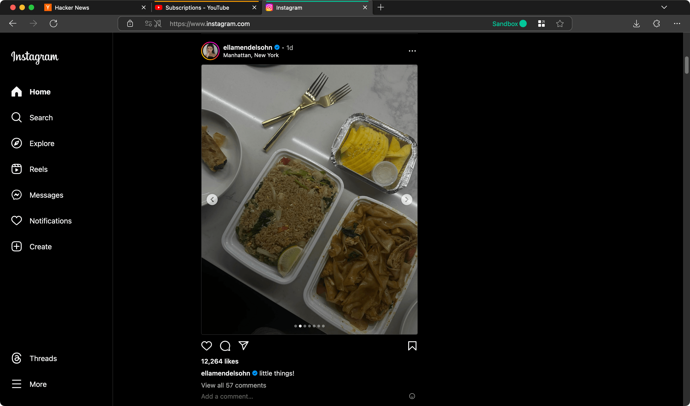

I have been using Firefox for ages. Here are some habits and configurations I have picked up along the way. May these come in handy if you are also a Firefox user, or persuade you to switch to Firefox if you are not.

## Container tabs

One of the reasons why I continue using Firefox is the [Multi-Account Containers](https://addons.mozilla.org/en-US/firefox/addon/multi-account-containers/) extension. If you juggle several Instagram accounts or need to access different AWS consoles with various roles, this extension is a lifesaver. It lets you open separate sessions on the same site within a single browser window, without the hassle of switching profiles. Imagine staying logged into Google on one container tab to watch YouTube, while keeping your search history out of Google's reach in another. This is a useful way to limit how much personal data tech corporations can collect, giving you more control over your privacy.

:::figure{.popout.popout-image.frame}

::caption[Firefox containers in action]
:::

## Search modifiers

When you search using the address bar, you can narrow your search with specific characters called _search modifiers_. Type them, add a space, and then enter your query. Here are some search modifiers built into Firefox[^1]:

- `^` shows matches in your browsing history
- `*` shows matches in your bookmarks
- `%` shows matches in your currently open tabs
- `#` shows matches where every search term is part of the title or part of a tag
- `+` shows matches in bookmarks that you have tagged
- `$` shows matches where every search term is part of the URL
- `?` shows only search suggestions, useful when Firefox treats your search as a URL instead of search query

You can create your own modifiers using [keywords](https://support.mozilla.org/en-US/kb/bookmarks-firefox#w_how-to-use-keywords-with-bookmarks) associated with a bookmark. For example, to set up a modifier `/yt` for YouTube searches, bookmark `https://www.youtube.com/results?search_query=%s` and assign the keyword `/yt` to it. The `%s` is where your search query goes. So, typing `/yt berrin keklikler` in the address bar will expand to <https://www.youtube.com/results?search_query=berrin+keklikler>.

[^1]: Listed on [Address bar autocomplete suggestions in Firefox](https://support.mozilla.org/en-US/kb/address-bar-autocomplete-firefox#w_changing-results-on-the-fly)

## uBlock Origin

It might seem silly to praise extension support, but Firefox is the only browser that officially supports my favorite extension, [uBlock Origin](https://github.com/gorhill/uBlock), on mobile[^2]. The ad-free experience is far better than Chrome[^3].

With Google actively making changes to [ruin extensions on Chrome](https://www.eff.org/deeplinks/2021/12/chrome-users-beware-manifest-v3-deceitful-and-threatening), Firefox might soon be the only desktop browser where uBlock Origin works [effectively](https://github.com/uBlockOrigin/uBlock-issues/issues/338).

[^2]: [Kiwi](https://kiwibrowser.com/) (on Android) and [Orion](https://browser.kagi.com/) (on iOS) also offer _experimental_ support for uBlock Origin.
[^3]: Safari on iOS does support ad blockers like the excellent [Wipr](https://apps.apple.com/us/app/wipr/id1030595027). However, the experience pales compared to using uBlock Origin on Firefox for Android. If you are on iOS, Safari is still your best option, as Firefox on iOS does not support extensions.
