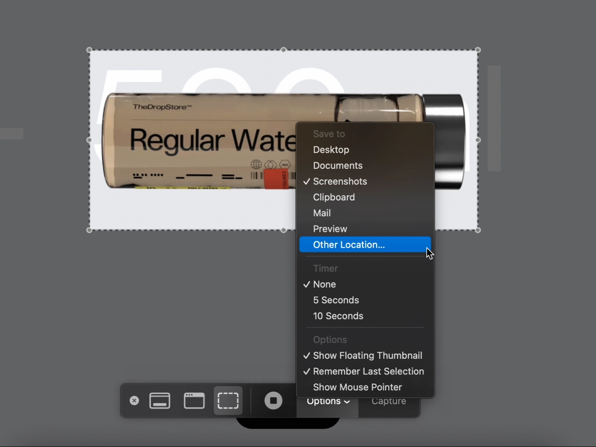

If you don't want macOS cluttering the Desktop with screenshots (and screen recordings), you can change the default location where macOS saves them. Press <kbd><kbd>Shift</kbd>+<kbd>Command</kbd>+<kbd>5</kbd></kbd>, select __Options__, and choose __Other Location&hellip;__. Pick a preferred directory in Finder.

:::assert
Check the __Remember Last Selection__ option so that macOS picks up the selected location next time.
:::

:::figure


::caption[Selecting a custom location for screenshots on macOS]
:::

If this setting is not present in your version of macOS, you can configure the screenshot location by running the following command in the terminal.

```sh
defaults write com.apple.screencapture "location" -string "~/Pictures/Captures" && killall SystemUIServer
```

To reset this preference, run the following command.

```sh
defaults delete com.apple.screencapture "location" && killall SystemUIServer
```
