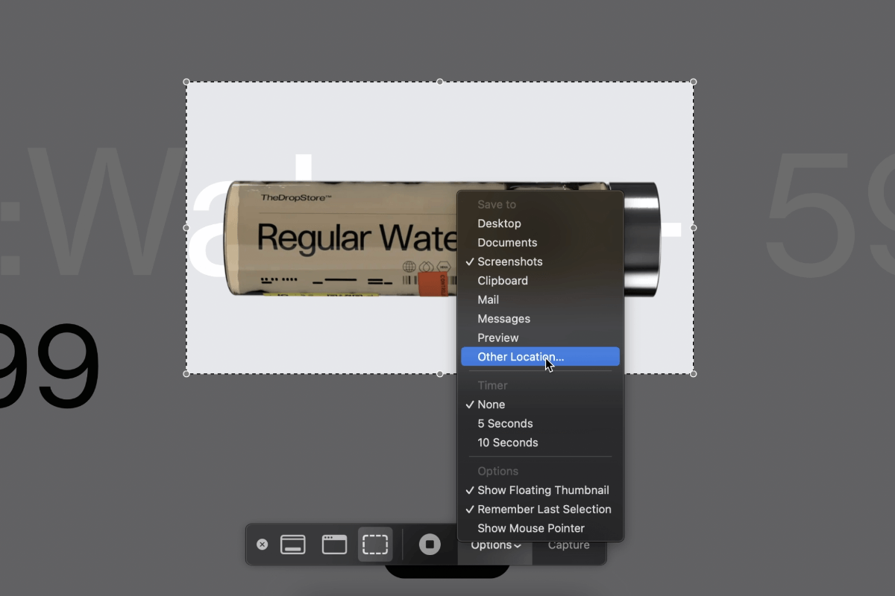

If you don't want macOS cluttering the Desktop with screenshots (and screen recordings), you can change the default location where macOS saves them. Press <kbd>Shift</kbd> <kbd>Command</kbd> <kbd>5</kbd>, hit __Options__, and select __Other Location&hellip;__. Pick a preferred directory in Finder. macOS will save the screenshots at the selected location from now.

:::figure{.popout.popout-image}

::caption[Selecting a custom location for screenshots and screen recordings on macOS]
:::

This setting may not be present in macOS versions preceding Mojave. You may have to resort to configuring defaults with Terminal on them.
