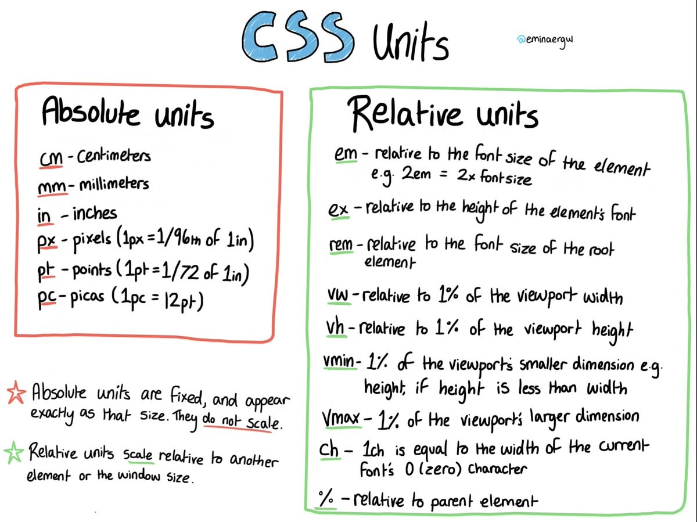

`ex` is such a great unit to specify line-height for headings while still keeping unitless line-height for the rest of document. [@eminaergul](https://minacodes.com/) Very nifty "pin-it on your desktop" guide.

> :::figure
> 
>
> CSS Units cheatsheet
> :::
>
> <cite>&mdash; [Mina](https://twitter.com/xmina141/status/1517507799646982146), :time{datetime="2022-04-22T14:17:08.000Z"}</cite>
