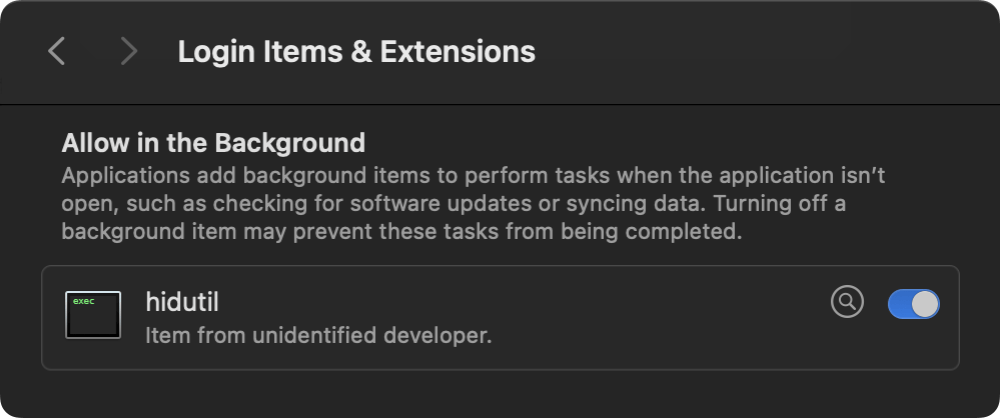

Recent versions of MacBook removed the function key shortcuts to quickly adjust the keyboard backlight brightness. Here is an approach on how you can remap Spotlight (F4) and Siri (F5) keys to restore this feature.

:::assert{title="Compatibility"}
Works on macOS 13 Ventura, macOS 14 Sonoma, and macOS 15 Sequoia
:::

At `~/Library/LaunchAgents`, create a file `com.local.KeyRemapping.plist` and paste the following configuration in it.

```xml
<?xml version="1.0" encoding="UTF-8"?>
<!DOCTYPE plist PUBLIC "-//Apple//DTD PLIST 1.0//EN" "http://www.apple.com/DTDs/PropertyList-1.0.dtd">
<plist version="1.0">
<dict>
    <key>Label</key>
    <string>com.local.KeyRemapping</string>
    <key>ProgramArguments</key>
    <array>
        <string>/usr/bin/hidutil</string>
        <string>property</string>
        <string>--set</string>
        <string>{"UserKeyMapping":[
            {
              "HIDKeyboardModifierMappingSrc": 0xC00000221,
              "HIDKeyboardModifierMappingDst": 0xFF00000009
            },
            {
              "HIDKeyboardModifierMappingSrc": 0xC000000CF,
              "HIDKeyboardModifierMappingDst": 0xFF00000008
            }
        ]}</string>
    </array>
    <key>RunAtLoad</key>
    <true/>
</dict>
</plist>
```

Restart the Mac to apply this configuration. Pressing the Spotlight (F4) key should now decrease the keyboard brightness, and pressing the Siri (F5) key should increase it.

---

In case you're wondering, the `com.local.KeyRemapping.plist` file adds a background item which keeps the keys remapped.

:::figure


::caption[Background item for `com.local.KeyRemapping.plist` (found under System Settings > General > Login Items & Extensions)]
:::
