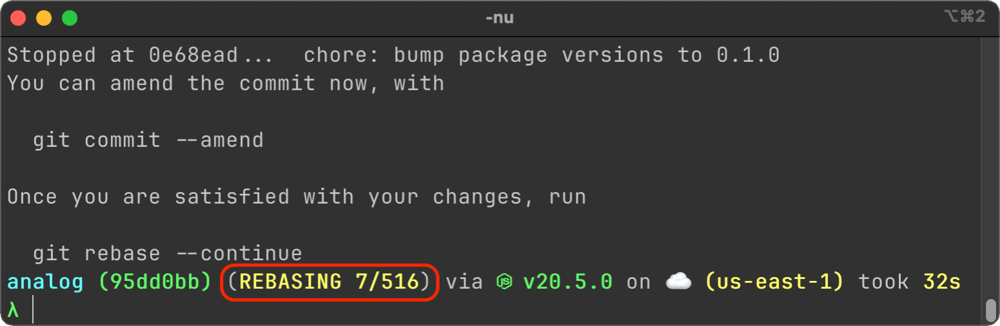

While generally avoided, rewriting Git history is occasionally needed for security reasons, or for maintaining a cleaner history. Here are some approaches to achieve this.

## Resetting the current state to an earlier state

If you want to go back to a specific commit on a branch, you can do so with any of the following commands.

```sh title="Resetting head to a specific commit"
git reset <commit_sha>
git reset --soft <commit_sha>
git reset --hard <commit_sha>
```

- By default, the `git reset` runs with `--mixed` flag. This moves the head of your branch to specified commit, and keeps the latest changes on the filesystem but removes them from index. When you run `git status`, you'll find the latest changes unstaged.
- Running `git reset` with `--soft` flag moves the head to the specified commit, and keeps the latest changes on the filesystem as well as the index. When you run `git status`, you'll find the latest changes staged.
- Running `git reset` with `--hard` flag moves the head to the specified commit, and removes the latest changes from the index as well as filesystem. When you run `git status`, you'll find a clean state with no pending changes.

| `git reset` | `--soft` | `--mixed` | `--hard` |
| ----------- | --------- | -------- | -------- |
| latest changes on filesystem | yes | yes | no |
| latest changes on Git index | yes | no | no |
| `git status` shows latest changes | staged | unstaged | no |

## Rewriting history with interactive rebase

Rebasing allows you to move, combine, or change a series of commits on a branch. You can also rebase one branch on another.

### Rebasing commits from checked out branch

Start a rebase from the commit from where you want to start the rewrite.

```sh
# to start from a specific commit
git rebase -i <commit_sha>

# to start from root commit
git rebase -i —root
```

### Rebasing commits from one branch to another

Alternatively, you may want to rebase from another branch, say `source`, to a target branch, say `target`. In such a case, start with creating a checkout from `source`.

```sh
# checkout both source and target
git checkout source
git checkout target

# checkout source on a new branch
git checkout -b rebased_target origin/source

# start the rebase
git rebase -i target
```

### Modifying the changesets

You might want to drop, squash, or edit some commits. When you mark all the items for the action that you want to take on a commit and quit the rebase dialog, rebase will start immediately. It'll show you remaining items for rebase on a counter in the terminal.

:::figure


A rebase counter displaying the current position of a rebase in progress
:::

#### Editing the changesets

Rebase will pause on the first commit where it encounters 
- a conflict (due to drop or squash action), or
- an edit action

In case of conflict, you'll have to resolve them. In case of edit, you can edit the files in the changeset. Once done, you can commit the changeset.

```sh
# opens the commit screen to review the commit message
git commit
```

#### Preserving the original commit timestamp

The `git commit` command doesn't keep the original commit timestamp. You can manually set `GIT_AUTHOR_DATE` and `GIT_COMMITTER_DATE` environment variables to keep the commit timestamp, as follows.

```sh
COMMIT_DATE="2023-05-14T09:31:15Z" GIT_AUTHOR_DATE=$COMMIT_DATE GIT_COMMITTER_DATE=$COMMIT_DATE git commit
```

### Finishing the rebase

After the commit, you'll have to explicitly continue the rebase.

```sh
git rebase —continue
```

After this command, you'd notice that the rebase count jumps up and the next changeset appears on the filesystem. Repeat the earlier steps for all changesets to finish the rewrite.
