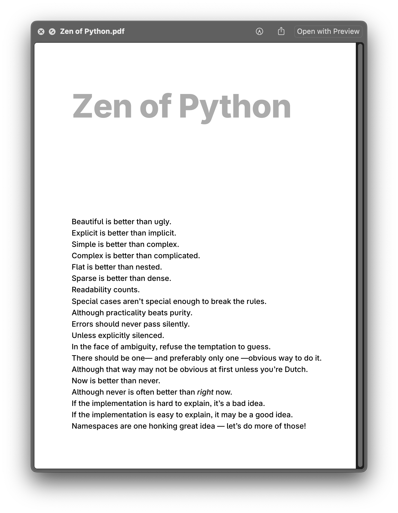

Playing with custom CSS snippets in [@obsidian](https://obsidian.md) to print out some posters. I've snippets for generating other documents as well (for example, my resume). Haven't opened Word or Pages for a long while.

:::figure

::caption[A poster in PDF format generated by Obsidian showcasing [Zen of Python](https://peps.python.org/pep-0020/)]
:::

> The snippet is available here:  
> https://gist.github.com/naiyerasif/0e5677accf6453b1504e51e7c1054b59
>
> P.S. I have [Inter Variable](https://rsms.me/inter/) (by [@rsms](https://rsms.me/)) installed on my machine which gives me these beautiful prints.
