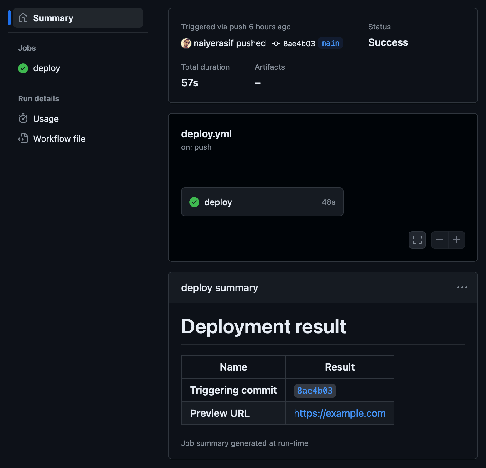

Today I learned that you can print custom job summaries for GitHub Actions by assigning a markdown string to the `GITHUB_STEP_SUMMARY` environment variable.

For example, the following step configuration,

```yml title="deploy.yml"
- name: Job summary
  run: |
    echo "# Deployment result" >> $GITHUB_STEP_SUMMARY
    echo "| Name                  | Result       |" >> $GITHUB_STEP_SUMMARY
    echo "| --------------------- | ------------ |" >> $GITHUB_STEP_SUMMARY
    echo "| **Triggering commit** | $COMMIT_URL  |" >> $GITHUB_STEP_SUMMARY
    echo "| **Preview URL**       | $PREVIEW_URL |" >> $GITHUB_STEP_SUMMARY
```

generates a job summary like this:

:::figure{.frame}


::caption[Job Summary of a finished GitHub Action job]
:::

See the following references for more examples.

- [Supercharging GitHub Actions with Job Summaries](https://github.blog/2022-05-09-supercharging-github-actions-with-job-summaries/)
- [Adding a job summary](https://docs.github.com/en/actions/using-workflows/workflow-commands-for-github-actions#adding-a-job-summary)
