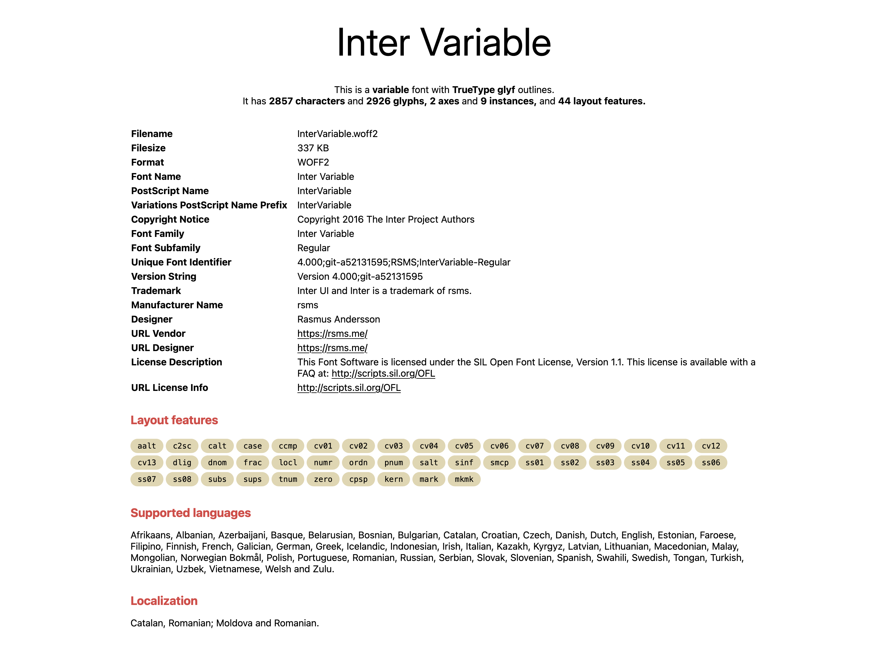
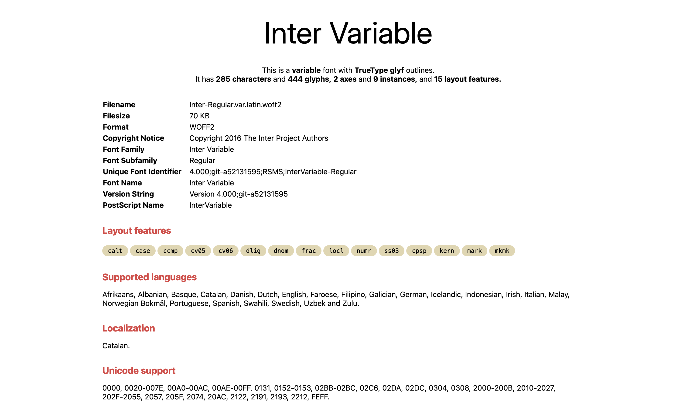

When I revamped this site last year, I also opted to use the latest version of [Inter](https://rsms.me/inter/) — v4. This version came with some lovely updates, such as a display variant with support for optical sizing, humanist style italics, round quotes and commas, and so on. Sadly, it also bumped the file size of the font (by 150% in case of the variable font). Large font files can degrade the performance of a web page so this was a noticeable regression.

:::figure{.frame}


Out of box, Inter 4.0 variable font supports 2926 glyphs, 9 weights, and 44 layout features.
:::

Inter is so large because it supports many languages and [OpenType features](https://developer.mozilla.org/en-US/docs/Web/CSS/CSS_fonts/OpenType_fonts_guide). _This is fantastic for a workhorse font._ Supporting different languages and layout features makes Inter a truly versatile font suited for use in so many places. However, this site is mostly in English, with occasional symbols and Greek characters thrown in. I can just include the support for those characters to get the job done. And that is where, subsetting comes into picture.

## So, what is subsetting?

Subsetting is a process to remove potentially unnecessary characters from a font file to reduce its size.

Here is how it goes.
- You identify the characters to include in a font file (also called a _unicode range_).
- You chop down the font files to include the characters in the unicode range.
- You adjust the font declarations in the CSS to tell the browser the unicode range supported by a font file (using a CSS property aptly called [`unicode-range`](https://developer.mozilla.org/en-US/docs/Web/CSS/@font-face/unicode-range)).

## Figuring out the unicode range

This is the trickiest part of the process: figuring out the characters to include in a font file. If a site is dynamic, you would have to run a script to browse enough pages of the site to give you a list of characters used on it. Things become easier if the site is static. You can analyze the static files of the site to get the unicode range. Tools, such as [`glyphhanger`](https://github.com/zachleat/glyphhanger), can automate the analysis for you.

By sheer coincidence, this site _is_ a static site 😁. So, all I had to do was to point `glyphhanger` to the production build of this site (located in a directory named `dist`).

```sh prompt{1}
npx glyphhanger ./dist
U+20-24,U+27-57,U+59,U+5A,U+5F,U+61-7D,U+A9,U+2014,U+2019,U+201C,U+201D
```

> I am using [npx](https://docs.npmjs.com/cli/v10/commands/npx) here to run `glyphhanger`. You would need Node.js (v22 in my case) installed and available on the `PATH` for this to work.

After some sleuthing (with the help of [Unicode Character table](https://jrgraphix.net/r/Unicode/) and Google Fonts), I found that the listed range provided by `glyphhanger` falls in the Latin unicode range. At this point, I could have gone ahead and generated a subset of Inter for the Latin characters. However, _subsetting a font aggressively is not a good idea_. I may be using only Latin characters _today_ but I may decide to use other characters in future. A Latin subset would not work when the characters outside the supported unicode range appear on this site.

To allow a bit of breathing room for future, I decided to generate more than one subset, each for the following unicode ranges.

- **Latin unicode range**: U+0000-00FF, U+0131, U+0152-0153, U+02BB-02BC, U+02C6, U+02DA, U+02DC, U+0304, U+0308, U+0329, U+2000-206F, U+2074, U+20AC, U+2122, U+2191, U+2193, U+2212, U+2215, U+FEFF, U+FFFD
- **Latin extended unicode range**: U+0100-02AF, U+0304, U+0308, U+0329, U+1E00-1E9F, U+1EF2-1EFF, U+2020, U+20A0-20AB, U+20AD-20C0, U+2113, U+2C60-2C7F, U+A720-A7FF
- **Greek and Greek extended unicode range**: U+0370-0377, U+037A-037F, U+0384-038A, U+038C, U+038E-03A1, U+03A3-03FF, U+1F00-1FFF

This means I would get three output files for each input font file.

## Subsetting with `pyftsubset`

Now that I knew about the unicode range suitable for this site, I needed a script to generate the subsets. [In the past](/post/2023/03/11/generating-webfonts-with-fonttools/), I had used [`fontTools`](https://github.com/fonttools/fonttools) to tweak the font files. I used the following script[^1] using the built-in subsetting tool called `pyftsubset` in `fontTools`. 

[^1]: Copied and modified from the [original script](https://ryanccn.dev/posts/performance-tales-fonts/) by Ryan Cao

```python
import subprocess

from rich.progress import track

from os import makedirs
from os.path import exists, splitext
from shutil import rmtree

from glob import iglob
from pathlib import Path

subsets = {
	"latin": "U+0000-00FF, U+0131, U+0152-0153, U+02BB-02BC, U+02C6, U+02DA, U+02DC, U+0304, U+0308, U+0329, U+2000-206F, U+2074, U+20AC, U+2122, U+2191, U+2193, U+2212, U+2215, U+FEFF, U+FFFD",
	"latin-ext": "U+0100-02AF, U+0304, U+0308, U+0329, U+1E00-1E9F, U+1EF2-1EFF, U+2020, U+20A0-20AB, U+20AD-20C0, U+2113, U+2C60-2C7F, U+A720-A7FF",
	"greek": "U+0370-0377, U+037A-037F, U+0384-038A, U+038C, U+038E-03A1, U+03A3-03FF, U+1F00-1FFF",
}
output_dir = "output"
layout_features = "ccmp,locl,mark,mkmk,calt,dlig,case,cpsp,kern,ss03,cv05,cv06"

if exists(output_dir):
	rmtree(output_dir)

makedirs(output_dir)

for filepath in iglob("input/*.woff2"):
	filename = Path(filepath).name

	for subset in track(subsets, description=f"Subsetting {filename}..."):
		u_range = subsets[subset]
		outputfile = splitext(filename)[0]

		subp_args = [
			"pyftsubset",
			filepath,
			f"--unicodes={u_range}",
			"--flavor=woff2",
			f"--output-file={output_dir}/{outputfile}.{subset}.woff2",
		]

		if layout_features is not None:
			subp_args.append(f"--layout-features+={layout_features}")

		subprocess.run(subp_args, check=True)
```

In this script, I am
- setting up the subsets and associated unicode ranges
- setting up the OpenType features that I wanted in the font (picked from the [Inter docs](https://rsms.me/inter/#features))
- iterating over all the font files (ending with the `.woff2` extension) in the `input` directory
- subsetting each file for the specified unicode range, and writing it in the `output` directory

To run this script, I needed a Python environment. Since I rarely use Python and did not want to install it for this one-off usecase, I created a `Dockerfile` with all the required dependencies.

```dockerfile
FROM python:3.12-alpine
RUN apk add --no-cache --virtual .build-deps gcc g++
RUN pip install brotli
RUN pip install fonttools
RUN pip install rich
RUN apk del .build-deps
WORKDIR /app
CMD ["python3", "run.py"]
```

I generated a Docker image using `docker build -t fontoptim .`, copied the files that I wanted to subset in the `input` directory, and ran the script as follows.

```sh prompt{1}
docker run --rm -v ${pwd}:/app fontoptim
Subsetting Inter-Regular.woff2... ━━━━━━━━━━━━━━━━━━━━━━━━━━━━ 100% 0:00:01
Subsetting Inter-Italic.woff2... ━━━━━━━━━━━━━━━━━━━━━━━━━━━━━ 100% 0:00:01
Subsetting Inter-Italic.var.woff2... ━━━━━━━━━━━━━━━━━━━━━━━━━ 100% 0:00:02
Subsetting Inter.var.woff2... ━━━━━━━━━━━━━━━━━━━━━━━━━━━━━━━━ 100% 0:00:02
```

> If `${pwd}` does not work, you can specify the full path of your working directory instead.

After successful run, I got 12 font files in the `output` directory (three for each input font file). A Latin subset now stood at 70 kB compared to 337 kB earlier.

:::figure{.frame}


Latin subset of Inter 4.0 variable font supports 444 glyphs, 9 weights, and 15 layout features.
:::

Note that this approach works nicely for both variable and static fonts.

## Tweaking the CSS font declarations

Since the font files now contain a specific range of characters, I needed to inform the browser about those ranges. The browser would then automatically load the correct file by detecting the characters on a webpage. Such are the wonders of modern CSS.

I created the following [Sass mixin](https://sass-lang.com/documentation/at-rules/mixin/) to iterate over the `latin`, `latin-ext` and `greek` subsets and generate three font declarations for each font.

```scss
@mixin font-face($font-family, $file-path, $font-style, $font-weight, $unicode-range) {
	@font-face {
		font-family: $font-family;
		font-display: swap;
		src: url("#{$file-path}.woff2") format("woff2");
		font-style: $font-style;
		font-weight: $font-weight;
		unicode-range: #{$unicode-range};
		@content;
	}
}

$subsets: (
	"latin": "U+0000-00FF, U+0131, U+0152-0153, U+02BB-02BC, U+02C6, U+02DA, U+02DC, U+0304, U+0308, U+0329, U+2000-206F, U+2074, U+20AC, U+2122, U+2191, U+2193, U+2212, U+2215, U+FEFF, U+FFFD",
	"latin-ext": "U+0100-02AF, U+0304, U+0308, U+0329, U+1E00-1E9F, U+1EF2-1EFF, U+2020, U+20A0-20AB, U+20AD-20C0, U+2113, U+2C60-2C7F, U+A720-A7FF",
	"greek": "U+0370-0377, U+037A-037F, U+0384-038A, U+038C, U+038E-03A1, U+03A3-03FF, U+1F00-1FFF"
);

@mixin subsetter($font-family, $file-path, $font-style, $font-weight) {
	@each $subset, $unicode-range in $subsets {
		@include font-face($font-family, "#{$file-path}.#{$subset}", $font-style, $font-weight, $unicode-range);
	}
}
```

I used the `subsetter` mixin as follows.

```scss
@include subsetter("Inter var", "Inter.var", "Regular", 100 900);
```

Once compiled, this gave me the following CSS output. 

```css
@font-face {
  font-family: "Inter var";
  font-display: swap;
  src: url("Inter.var.latin.woff2") format("woff2");
  font-style: "Regular";
  font-weight: 100 900;
  unicode-range: U+0000-00FF, U+0131, U+0152-0153, U+02BB-02BC, U+02C6, U+02DA, U+02DC, U+0304, U+0308, U+0329, U+2000-206F, U+2074, U+20AC, U+2122, U+2191, U+2193, U+2212, U+2215, U+FEFF, U+FFFD;
}
@font-face {
  font-family: "Inter var";
  font-display: swap;
  src: url("Inter.var.latin-ext.woff2") format("woff2");
  font-style: "Regular";
  font-weight: 100 900;
  unicode-range: U+0100-02AF, U+0304, U+0308, U+0329, U+1E00-1E9F, U+1EF2-1EFF, U+2020, U+20A0-20AB, U+20AD-20C0, U+2113, U+2C60-2C7F, U+A720-A7FF;
}
@font-face {
  font-family: "Inter var";
  font-display: swap;
  src: url("Inter.var.greek.woff2") format("woff2");
  font-style: "Regular";
  font-weight: 100 900;
  unicode-range: U+0370-0377, U+037A-037F, U+0384-038A, U+038C, U+038E-03A1, U+03A3-03FF, U+1F00-1FFF;
}
```

> You can experiment with the mixin on the [Sass Playground](https://sass-lang.com/playground/).

## Conclusion

- Subsetting is a useful technique to improve font performance.
- Do not subset the fonts too aggressively. Use a unicode range that gives you some flexibility for future content.
- Always check the license of the font that you are subsetting. Some foundries forbid the modification of their fonts.

---

**Source code**

- [webfont-subsetting](https://github.com/Microflash/guides/tree/main/miscellaneous/webfont-subsetting)

**Related**

- [Unicode Character Ranges](https://jrgraphix.net/r/Unicode/)
- [List of Unicode Symbols](https://symbl.cc/en/unicode-table/)
- [Unicode 15.1 Character Code Charts](https://www.unicode.org/charts/)
- [Improving font performance](https://developer.mozilla.org/en-US/docs/Learn/Performance/CSS#improving_font_performance)
